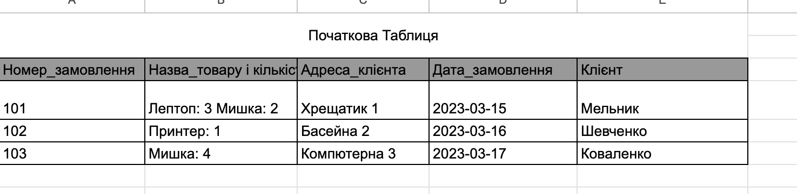
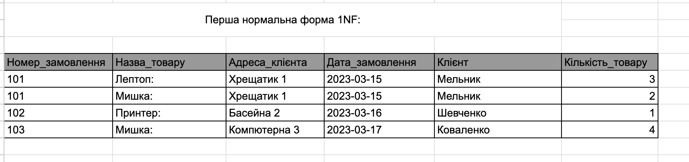
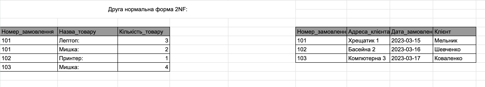
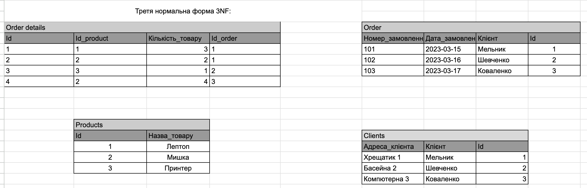
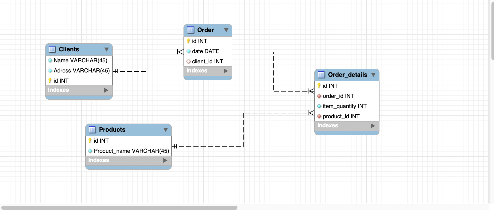
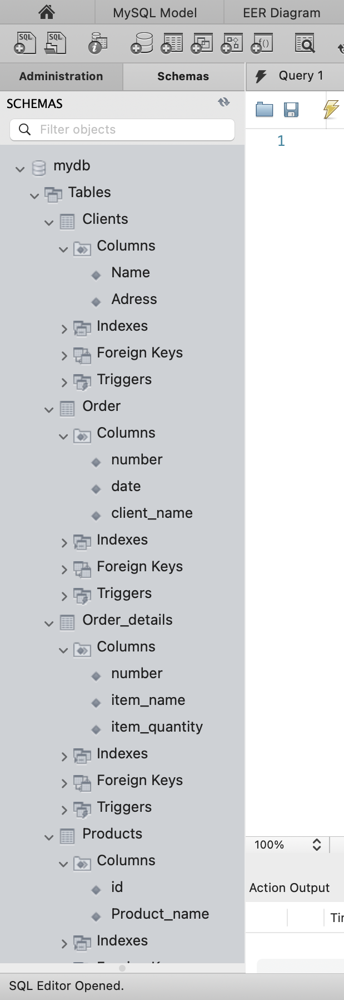

# Database Normalization and ER Diagram

This project demonstrates the process of normalizing a database table through the three normal forms (1NF, 2NF, 3NF) and concludes with the creation of an Entity-Relationship (ER) diagram for the resulting database schema.

### 1. **Proto-Form:**  
Proto-Forma:  

---

## Steps:

### 1. **First Normal Form (1NF):**  
Below is the screenshot of the table converted into 1NF:  

---

### 2. **Second Normal Form (2NF):**  
After addressing partial dependencies, the table was normalized to 2NF:  

---

### 3. **Third Normal Form (3NF):**  
By eliminating transitive dependencies, the table was normalized to 3NF:  

---

### 4. **Entity-Relationship Diagram:**  
The ER diagram for the normalized tables is shown below:  

---

### 5. **Final Schema:**  
The final structure of the database schema:  

---

This process ensures data integrity, removes redundancy, and optimizes the database for better performance.
